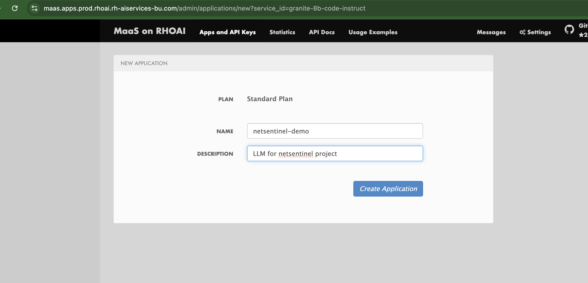

# Creating a New API Token for "Models as a Service" on OpenShift AI

## Steps to Generate and Use a New API Token

### 1. Navigate to the Applications Page

Visit the following URL to access the "Models as a Service" applications admin page:
[https://maas.apps.prod.rhoai.rh-aiservices-bu.com/admin/applications](https://maas.apps.prod.rhoai.rh-aiservices-bu.com/admin/applications)

### 2. Create a New Application

- Click on **"Create new application"**.
  

### 3. Select a Model

- From the list of available models, select **"Granite-8B-Code-Instruct"**.
  

### 4. Fill Out the Application Form

- Provide the following details:
  - **Name**: `netsentinel-demo`
  - **Description**: `LLM endpoints for netsentinel agent`
    

### 5. Retrieve API Information

After creating the application, you'll be presented with the following details:

- **URL**: `https://granite-8b-code-instruct-maas-apicast-production.apps.prod.rhoai.rh-aiservices-bu.com:443`
- **Model Name**: `granite-8b-code-instruct-128k`
- **API Key**: (e.g., `••••••••••••••••••••••••••••••••••••••••`)


### 6. Update the `netsentinel` Configuration

Replace the relevant placeholders in the `netsentinel` app configuration file (`k8s/apps/overlays/rhlab/netsentinel/app-config.yaml`) with the retrieved details:

```yaml
models:
  predictive:
    url: "http://modelmesh-serving.netsentinel:8008/v2/models/netsentinel/infer"
    token: ""
    verify_ssl: true
  llm:
    url: "https://granite-8b-code-instruct-maas-apicast-production.apps.prod.rhoai.rh-aiservices-bu.com:443/v1/chat/completions"
    model_name: "granite-8b-code-instruct-128k"
    token: "YOUR_API_KEY_HERE"
    verify_ssl: true
  nlu:
    model_path: "models/rasa/nlu-model.gz"
```

Replace `YOUR_API_KEY_HERE` with the API key retrieved in step 5. You can use following command for this.

```
sed -i '' 's/token: "<YOUR_API_KEY_HERE>"/token: "your-api-key-here"/' k8s/apps/overlays/rhlab/netsentinel/app-config.yaml
```

Your configuration is now updated to use the new API token with the `"Granite-8B-Code-Instruct"` model in the `netsentinel` application.
